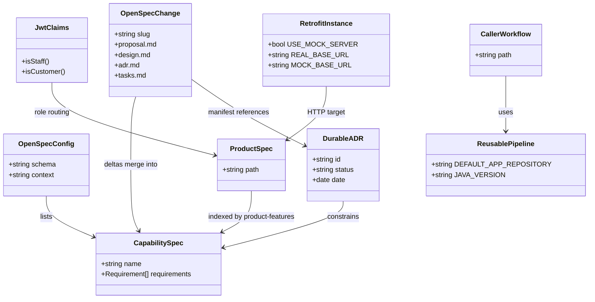

# Align mobile documentation to OpenSpec, OpenSPDD, and MADR

## Requirements

Establish a durable, agent-readable documentation contract for the Android operations app so HR-242 and existing product SDD stay accurate and consistent with sibling repos and the Spring API.

- Record living behavior in OpenSpec (`spec-driven-with-adr`).
- Record implementation constraints in an OpenSPDD REASONS Canvas.
- Record architectural why in MADR-short ADRs under `adr/`.
- Keep `specification/` as product detail; index it; fix drifted backend/client facts.
- Do not claim this repository deploys to AWS, GHCR, or Play Store.

## Entities

## Approach

1. Documentation architecture:
   - OpenSpec specs = current behavior (what).
   - ADRs = in-force architecture (why).
   - OpenSPDD canvas = this change's executable contract (how).
   - `specification/` = product SDD detail, mapped by `product-features`.

2. Technical implementation:
   - Schema `spec-driven-with-adr` in `openspec/config.yaml`.
   - Artifact order `proposal → specs → design → adr → tasks`.
   - Durable ADRs at `adr/NNNN-kebab-title.md` (MADR-short). Change-local `adr.md` is a manifest only.
   - Promote informal `specification/decisions/` into `adr/` and leave stubs.

3. Business / operator rules:
   - Canonical repo `Heavy-Rental/heavy-rental-mobile`.
   - First-time Google → `ROLE_DRIVER`; Google `ROLE_USER` refused on the client.
   - `ROLE_DRIVER` is allowed on ops APIs.
   - Default HTTP is Spring `:8080`.
   - No portal CD in this repo.

## Structure

### Inheritance Relationships

1. OpenSpec change deltas ADDED/MODIFIED/REMOVED apply onto `openspec/specs/<capability>/spec.md`.
2. A superseding ADR does not edit the prior ADR file; in-force status is derived from `Supersedes:`.
3. Product feature specs are not subclasses of OpenSpec capabilities; `product-features` indexes them.

### Dependencies

1. Design reads in-force ADRs before tasks.
2. Tasks honor OpenSPDD Safeguards and OpenSpec scenarios.
3. Server facts depend on `heavy-rental-spring-rest-api` OpenSpec, not on archived mobile notes.
4. CI reusable workflows depend on `assert-caller` gates.

### Layered Architecture

1. Operator layer: GitHub Actions callers (`mobile-*-caller.yml`).
2. Pipeline layer: reusable workflows.
3. Contract layer: `openspec/specs/`, `adr/`, `spdd/prompt/`.
4. Product SDD layer: `specification/`.
5. App layer: `app/` (unchanged in this change).

## Operations

### Create OpenSpec config - `openspec/config.yaml`

1. Responsibility: Declare schema `spec-driven-with-adr` and project context/rules.
2. Constraints: Canonical repo string; conflict rule code/YAML → OpenSpec → specification.

### Create capability specs - `openspec/specs/*`

1. Responsibility: Living SHALL requirements with `#### Scenario` GIVEN/WHEN/THEN.
2. Capabilities: `documentation-system`, `project-environment`, `ci-pipelines`, `product-features`.

### Create ADRs - `adr/0001` through `adr/0008`

1. Responsibility: Documentation stack, canonical repo, OpenAPI, mocks, Google, default HTTP, JWT routing.
2. Constraints: Status accepted; immutable after write; listed in `adr/README.md`.

### Create OpenSpec change archive

1. Responsibility: proposal, design, adr manifest, tasks (checked), ADDED deltas.
2. Path: `openspec/changes/archive/2026-08-27-hr-242-openspec-openspdd-adr/`.

### Update product SDD - `specification/`

1. Responsibility: Correct Google role, driver access, HR-80, multi-asset `items`, README index, overview, testing guide, OpenAPI descriptions.
2. Leave Gherkin structure in place so git history stays reviewable.

### Update root README

1. Responsibility: Replace Best-README-Template with the actual app, stack, docs table, pipelines.

## Norms

1. OpenSpec requirements use RFC 2119 MUST/SHALL; each has at least one `#### Scenario`.
2. ADRs use MADR-short: title, status/date, context, decision, consequences. Sequence `NNNN` is monotonic.
3. OpenSPDD prompt files use `{JIRA}-{TIMESTAMP}-[{ACTION}]-{scope}-{description}.md`.
4. Do not edit accepted ADR files. Supersede with a new file.
5. Server-overlapping facts MUST match Spring OpenSpec (`auth-login-logout`, `booking-delivery-return`).
6. Markdown in `specification/` keeps existing SDD section names so git history stays reviewable.

## Safeguards

1. Functional: Do not rewrite Kotlin application logic as part of this documentation change.
2. Functional: Do not flip `USE_MOCK_SERVER` to `true` on `develop`.
3. Security: Do not commit Google client secrets, JWT signing keys, or `sk_` Stripe keys. The existing `WEB_CLIENT_ID` in `LoginScreen.kt` is a public OAuth client id (not a secret) — do not treat this change as a reason to relocate it.
4. Consistency: `DEFAULT_APP_REPOSITORY` MUST stay `Heavy-Rental/heavy-rental-mobile` in Fast Feedback, Integration, and Release.
5. Consistency: If `specification/product/01-login.md` and Spring `auth-login-logout` disagree, treat Spring as truth for server facts and fix the mobile spec.
6. Scope: Do not delete `BLANK_README.md` or `android-ci.yml` in this change (legacy leftovers noted, not remediated).
7. OpenSpec: Do not store durable ADRs inside `openspec/changes/`.
8. Roles: Do not document first-time Google as `ROLE_USER`. Do not document `ROLE_DRIVER` as locked out of deliveries/returns/bookings.
9. History: Do not claim booking routes exist only on backend branch `HR-80`.
10. CD: Do not add Academy/paid CD callers or `secrets: inherit` to this repository in this change.
