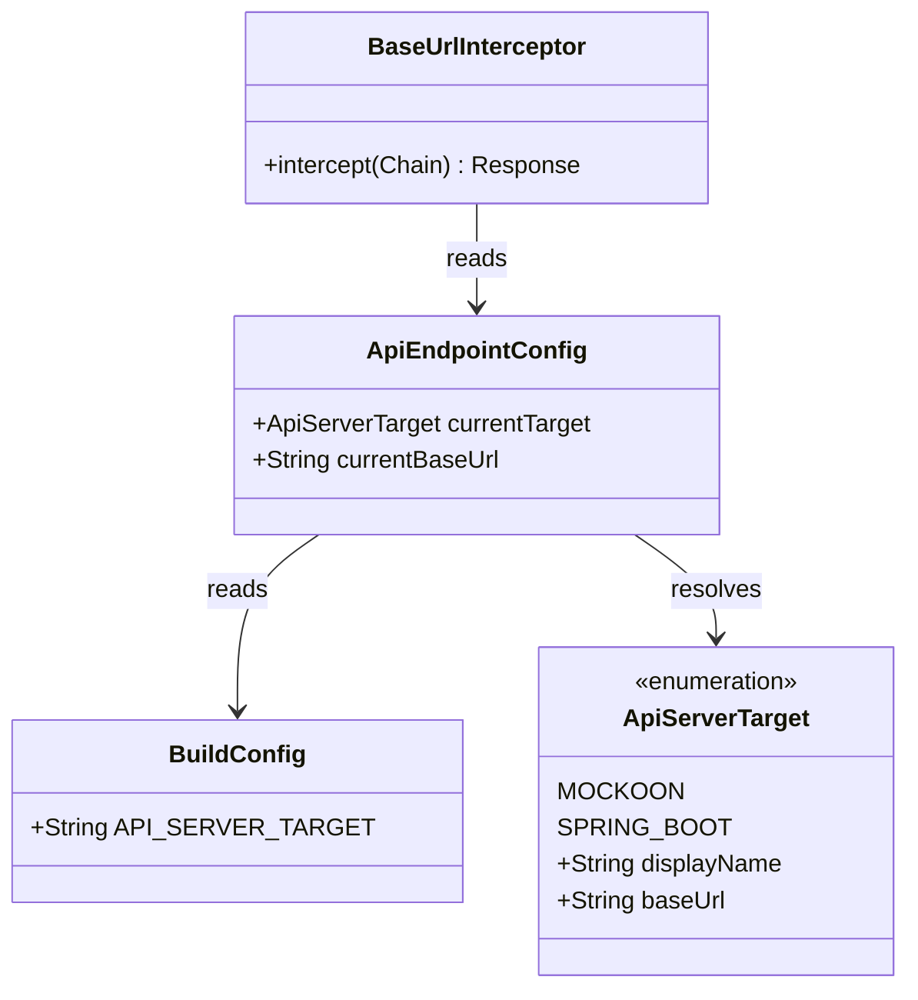

# HR-84 — Runtime API endpoint toggle (Mockoon ↔ Spring Boot)

## Requirements

Enable developers to select Mockoon/Prism vs Spring Boot REST base URL via a
properties file (`app/api.properties`, optional `local.properties` override),
without any in-app UI toggle. Default remains Mockoon. Changing the property
requires Sync/Rebuild. Applied through BuildConfig + BaseUrlInterceptor.

**DoD**: FR/SC in `specs/084-api-endpoint-toggle/spec.md` satisfied; debug compile green.

## Entities

## Approach

1. **Configuration model**:
   - Enum `ApiServerTarget` with fixed emulator URLs:
     - MOCKOON → `http://10.0.2.2:8081/`
     - SPRING_BOOT → `http://10.0.2.2:8080/`
   - `app/api.properties` key `api.server.target`; optional root `local.properties` override.
   - Gradle injects `BuildConfig.API_SERVER_TARGET`.

2. **Networking**:
   - Keep single Retrofit/OkHttp stack.
   - `BaseUrlInterceptor` rewrites scheme/host/port from `ApiEndpointConfig.currentBaseUrl`.
   - Register interceptor before `AuthInterceptor` and logging.

3. **UI**:
   - No in-app endpoint Switch.

4. **Trade-offs**:
   - Build-time config over runtime UI (explicit product requirement).
   - Interceptor preferred over rebuilding Retrofit.
   - No custom URL field in v1.

## Structure

### Dependencies

1. Gradle reads properties → BuildConfig.
2. `ApiEndpointConfig` resolves enum from BuildConfig (read-only).
3. `AuthRepository` / `BookingRepository` use `RetrofitInstance.api`.
4. `BaseUrlInterceptor` depends only on `ApiEndpointConfig`.

### Layered architecture

1. **Build**: `api.properties` / `local.properties`.  
2. **Config**: `ApiEndpointConfig` (read-only).  
3. **Network**: `BaseUrlInterceptor` + `RetrofitInstance`.  

## Operations

### Create — `app/api.properties`

1. Key `api.server.target=MOCKOON` with comments for `SPRING_BOOT`.

### Update — `app/build.gradle.kts`

1. Load `api.properties`, overlay root `local.properties`.
2. Validate target ∈ {MOCKOON, SPRING_BOOT}.
3. `buildConfigField("String", "API_SERVER_TARGET", …)`.
4. `buildFeatures { buildConfig = true }`.

### Create enum — `ApiServerTarget`

1. Package `com.heavyrental.network`.
2. Values `MOCKOON`, `SPRING_BOOT` with `displayName`, `baseUrl`.
3. Companion: `DEFAULT`, `fromName`.

### Create object — `ApiEndpointConfig`

1. Read-only: `currentTarget` / `currentBaseUrl` from `BuildConfig.API_SERVER_TARGET`.
2. No SharedPreferences; no `setTarget`.

### Create class — `BaseUrlInterceptor`

1. Rewrite scheme/host/port from `ApiEndpointConfig.currentBaseUrl`.

### Update — `RetrofitInstance`

1. Register `BaseUrlInterceptor` first.
2. Placeholder base URL = default target.

### Update — UI / ViewModel

1. Remove Login Switch, toggle params, and `setApiServerTarget`.

## Norms

1. Network config under `com.heavyrental.network`.
2. URLs keep trailing slash for Retrofit.
3. Property key: `api.server.target` (snake.case).
4. Spec Kit `specs/084-…` is product truth; this REASONS file is design contract.

## Safeguards

1. Only two targets; default Mockoon.
2. Invalid property values fail Gradle configuration.
3. No in-app UI to change API host.
4. No custom LAN URL / auto-detect in v1.
5. Do not change OpenAPI paths as part of this feature — host only.
6. Offline list seed rules from `005-offline-fallback` unchanged.
